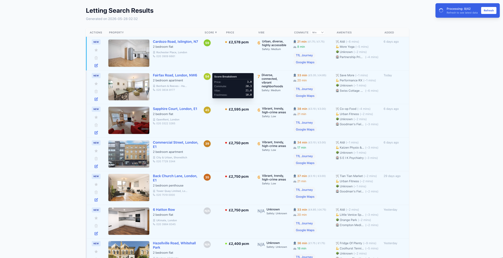

# Rightmove Lettings Triager 🏡🚇📊

**The Problem:** Searching for London rentals on Rightmove is painfully tedious. You have to copy addresses, manually plug them into Google Maps or Citymapper to calculate commute times, research if neighborhoods are safe/lively, check if supermarkets or parks are nearby, and somehow keep track of flats you’ve already dismissed, viewed, or shortlisted.

**The Goal:** This script automates that entire research and evaluation loop. It scrapes properties directly from Rightmove, enriches them with multi-modal commute times (TfL), local amenities (OpenStreetMap), and neighborhood vibes (Gemini AI), and aggregates them into a stateful, interactive dashboard where you can easily evaluate, shortlist, and add notes to properties.

---

> 💡 **HOT TIP (Advanced Flat-Hunting Workflow):** Set up a saved search with **Email Alerts** on Rightmove for your desired area. Whenever you receive a new alert email, simply copy the URL from the email, feed it into this script, and open your dashboard. The program's built-in **History Manager** will automatically filter out any flats you've already dismissed or viewed, highlighting only the **brand-new listings** with their fully enriched metrics instantly!

---



---

## 🛠️ Prerequisites
Before running the script, ensure you have:
*   **Python 3.11+** (The project uses the standard `tomllib` library, which requires Python 3.11 or newer).
*   **TfL Unified API Credentials** (Free app ID and key from [TfL Developer Portal](https://api-portal.tfl.gov.uk/) to calculate commute times and fares).
*   **Google Gemini CLI / API Key** (To query vibes and neighborhood insights).
*   **Active Internet Connection** (To fetch live listings from Rightmove, commute data from TfL, and local amenities from OpenStreetMap).

---

## 🌟 Core Features

*   **Automated Scraping & Auto-Pagination:** Provide page 1 of any Rightmove search URL, and the script automatically browses through all result pages to extract every flat.
*   **History & Triage Manager:** Tracks the state of flats (`New`, `Viewed`, `Shortlisted`, `Dismissed`) across sessions in `history.json` to prevent redundant analysis.
*   **Multi-Modal Commute (TfL API):** Calculates exact Public Transport and Cycling travel times to your office, standardized to a *Tuesday 9:00 AM benchmark* for fair comparison. Includes Peak/Off-Peak fare costs.
*   **Amenity Proximity (OSM API):** Searches OpenStreetMap via a fast French mirror to map nearby supermarkets, gyms, parks, hospitals, and doctors within walking distance.
*   **AI Neighborhood "Vibes" (Gemini):** Pre-fetches postcode districts to batch-query Gemini for area safety evaluations, 3-word summaries, and 1-10 "vibe scores."
*   **Smart Multi-Weighted Scoring (0-100):** Aggregates Price, Commute, Vibe, and Freshness into a unified score. The score is strictly set to `N/A` if critical parameters like Price, Commute, or Vibe are missing.
*   **Relative Price Dots:** Dynamic green-to-red color indicator showing how cheap or expensive a flat is relative to all other search results.
*   **Interactive Dashboard:** A local web server (`http://localhost:8888`) featuring progressive real-time loading, star/trash inbox triage, persistent inline text notes, and URL sorting.
*   **Fast Instant Termination:** Hit **`Ctrl+C`** at any time to instantly kill the entire script and background threads.

---

## 🚀 Setup & Installation

### 1. Clone & Set Up Virtual Environment
```bash
git clone https://github.com/itsmuaaz/rightmove-lettings-triager.git
cd rightmove-lettings-triager
python3 -m venv venv
source venv/bin/activate
pip install -r requirements.txt
```

### 2. Configure Credentials & Work Location
Create a `.env` file in the root directory:
```env
TFL_APP_ID=your_tfl_app_id
TFL_APP_KEY=your_tfl_app_key
GOOGLE_MAPS_API_KEY=your_google_maps_api_key  # Optional fallback
```
Set your office's coordinates in `rightmove_search.py` (Line 21):
```python
WORK_LOCATION_COORDS = (51.5349, -0.1238)  # Latitude, Longitude (e.g. King's Cross)
```

### 3. Run the Script
Execute the script using your Rightmove search URL:
```bash
python rightmove_search.py "YOUR_RIGHTMOVE_URL"
```
Choose whether to calibrate scoring weights at the CLI prompt, and then open **`http://localhost:8888`** in your browser. Watch properties enrich progressively in real-time!

---

## 🧪 Running Tests
The codebase comes with **175 automated unit and integration tests**:
```bash
pytest
```
